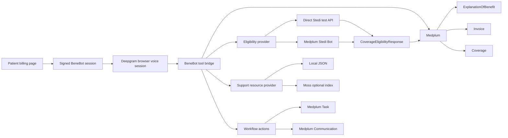
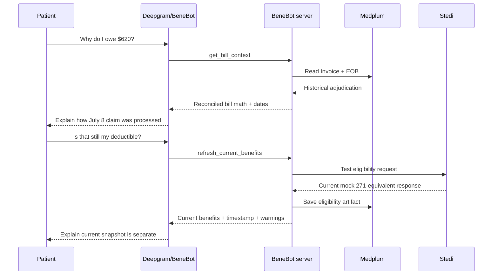

# BeneBot — End-to-End Hackathon Build Specification

**Status:** Build-ready  
**Target:** YC × Medplum Hackathon 2026  
**Primary implementation agent:** Codex app  
**Application type:** Synthetic-data demonstration only  
**Submission deadline:** August 1, 2026, 5:00 PM Pacific

---

## 1. Executive summary

BeneBot is a voice-first medical-bill explainer embedded directly in a patient billing experience.

Every bill includes an **“I wanna talk about this”** button. When selected, BeneBot:

1. Opens a real-time voice conversation using Deepgram.
2. Uses the authenticated billing-page session to identify the synthetic patient and specific bill.
3. Reads the historical adjudication associated with that bill from Medplum.
4. Explains, in plain language, how the insurer arrived at the patient-responsibility amount.
5. Optionally refreshes the patient’s **current** eligibility and benefits through Stedi test mode.
6. Clearly distinguishes historical claim adjudication from current benefit status.
7. Supports English and Spanish, including mid-conversation language switching.
8. Finds appropriate billing-help resources from a curated demo directory.
9. Creates a follow-up `Task` and a concise conversation `Communication` in Medplum.
10. Shows the resulting workflow in a staff-facing audit view.

### One-line product description

> BeneBot explains the bill you received, refreshes the benefits you have now, and helps you take the next step—in the language you prefer.

### Central accuracy principle

BeneBot must never treat current eligibility data as the explanation for a historical bill.

- **Historical “why do I owe this?”** comes from `ExplanationOfBenefit` or `ClaimResponse`.
- **Current “what are my benefits now?”** comes from Stedi and is stored as `CoverageEligibilityResponse`.
- **Current balance/status** comes from `Invoice` or the billing-system representation.

The UI and agent must display the source and date of each category.

---

## 2. Demo story

The demo follows one synthetic patient:

- **Patient:** Jane Doe
- **Date of birth:** April 4, 2004
- **Member ID:** AETNA12345
- **Payer:** Aetna test payer
- **Provider:** Bayview Imaging
- **Date of service:** July 8, 2026
- **Service:** MRI of the lower back
- **Bill issued:** July 28, 2026
- **Amount due:** $620

These patient fields intentionally match Stedi’s documented test-mode identity. Do not replace them unless the Stedi test case is changed in a coordinated way.

### Bill math

| Component | Amount |
|---|---:|
| Provider billed | $2,400 |
| Contractual/network discount | −$1,300 |
| Allowed amount | $1,100 |
| Deductible applied | $500 |
| Coinsurance | $120 |
| Insurer paid | $480 |
| **Patient responsibility** | **$620** |

### Deterministic invariants

```text
allowedAmount = billedAmount - contractualAdjustment
patientResponsibility = deductibleApplied + copay + coinsurance + nonCovered
insurerPaid = allowedAmount - patientResponsibility
```

For the demo:

```text
1100 = 2400 - 1300
620 = 500 + 0 + 120 + 0
480 = 1100 - 620
```

The LLM may explain these values, but it must not derive them. Application code normalizes and validates all amounts before they are exposed to the agent.

---

## 3. Product goals and non-goals

### P0 goals

The build is complete when all of the following work:

- A synthetic Medplum patient, coverage, EOB, encounter, and invoice can be seeded idempotently.
- The patient sees a polished bill page with **“I wanna talk about this.”**
- The browser obtains a short-lived Deepgram token from the server.
- A Deepgram voice session can answer questions about the $620 bill.
- The explanation uses normalized EOB adjudication data.
- BeneBot can switch between English and Spanish.
- BeneBot can invoke a live Stedi test-mode eligibility request.
- The current-benefits response is saved in Medplum or visibly falls back to a labeled fixture.
- BeneBot can retrieve one or more relevant assistance resources.
- The user can request a billing follow-up.
- The application creates a Medplum `Task`.
- The application creates a Medplum `Communication` summary.
- A staff page shows the resulting workflow artifacts and timestamps.
- Text input remains available as a fallback for microphone or demo failure.

### P1 goals

Complete only after P0:

- Medplum Insurance Eligibility Bot adapter.
- Moss semantic index for resource search.
- Animated tool-call timeline.
- Playback-free session history.
- Additional Spanish resource content.
- Improved responsive/mobile polish.

### Explicit non-goals

Do not build:

- Real PHI workflows.
- Production patient enrollment.
- Voice biometrics.
- SSN-based authentication.
- PSTN calling or live call transfer.
- Live Reddit scraping.
- Real payer phone-tree automation.
- Automated appeals.
- General chart question answering.
- Support for arbitrary payers or bills.
- More than English and Spanish.
- Raw audio storage.
- A full revenue-cycle-management system.

---


## Architecture at a glance



### Trust boundaries

```text
Browser:
- Receives a short-lived BeneBot session and temporary Deepgram token.
- Never receives Medplum client secrets, the Deepgram API key, or the Stedi key.
- Never chooses the patient or bill after session creation.

BeneBot server:
- Validates session scope.
- Performs all Medplum, Stedi, and resource-index operations.
- Normalizes financial data before returning it to the agent.
- Persists Tasks, Communications, and eligibility artifacts.

External services:
- Deepgram handles real-time voice and tool-call orchestration.
- Stedi test mode returns mock current eligibility data.
- Moss, when enabled, contains generic assistance content only.
```

### Data timeline




## 4. Recommended stack

Use a greenfield Next.js application unless an existing hackathon repository already has an equivalent foundation.

- Next.js App Router
- React
- TypeScript with `strict: true`
- Tailwind CSS
- shadcn/ui-compatible components
- `@medplum/core`
- `@medplum/fhirtypes`
- `@deepgram/ui`
- `zod`
- `jose`
- Vitest
- Playwright
- Optional: `@moss-dev/moss`

### Initial scaffolding

Run each command separately.

```bash
npx create-next-app@latest benebot --typescript --tailwind --eslint --app --import-alias="@/*"
```

```bash
cd benebot
```

```bash
npm install @medplum/core @medplum/fhirtypes @deepgram/ui zod jose
```

```bash
npm install -D vitest @testing-library/react @testing-library/jest-dom playwright tsx
```

Optional Moss dependency:

```bash
npm install @moss-dev/moss
```

### Required scripts

Add these package scripts:

```json
{
  "scripts": {
    "dev": "next dev",
    "build": "next build",
    "lint": "next lint",
    "typecheck": "tsc --noEmit",
    "test": "vitest run",
    "test:watch": "vitest",
    "test:e2e": "playwright test",
    "seed": "tsx scripts/seed-medplum.ts"
  }
}
```

---

## 5. Repository layout

```text
.
├── AGENTS.md
├── BENEBOT_BUILD_SPEC.md
├── CODEX_START_PROMPT.md
├── app
│   ├── api
│   │   ├── benebot
│   │   │   └── session
│   │   │       └── route.ts
│   │   ├── deepgram-token
│   │   │   └── route.ts
│   │   └── tools
│   │       ├── get-bill-context
│   │       │   └── route.ts
│   │       ├── refresh-benefits
│   │       │   └── route.ts
│   │       ├── request-followup
│   │       │   └── route.ts
│   │       ├── save-summary
│   │       │   └── route.ts
│   │       └── search-resources
│   │           └── route.ts
│   ├── bill
│   │   └── [invoiceId]
│   │       └── page.tsx
│   ├── staff
│   │   └── page.tsx
│   ├── globals.css
│   ├── layout.tsx
│   └── page.tsx
├── components
│   ├── bill
│   │   ├── bill-breakdown.tsx
│   │   ├── bill-header.tsx
│   │   └── source-date-badge.tsx
│   ├── staff
│   │   ├── artifact-card.tsx
│   │   └── session-summary.tsx
│   └── voice
│       ├── benebot-panel.tsx
│       ├── resource-card.tsx
│       ├── transcript.tsx
│       └── tool-activity.tsx
├── data
│   └── demo-resources.json
├── fixtures
│   ├── benebot-fhir-seed.json
│   ├── demo-resources.json
│   ├── stedi-aetna-test-request.json
│   └── stedi-normalized-fallback.json
├── lib
│   ├── billing
│   │   ├── math.ts
│   │   ├── normalize-eob.ts
│   │   └── types.ts
│   ├── deepgram
│   │   ├── config.ts
│   │   ├── prompt.ts
│   │   └── tools.ts
│   ├── medplum
│   │   ├── queries.ts
│   │   ├── server.ts
│   │   └── write-artifacts.ts
│   ├── resources
│   │   ├── local-provider.ts
│   │   ├── moss-provider.ts
│   │   ├── provider.ts
│   │   └── types.ts
│   ├── stedi
│   │   ├── client.ts
│   │   ├── direct-test-provider.ts
│   │   ├── medplum-bot-provider.ts
│   │   ├── normalize.ts
│   │   ├── provider.ts
│   │   └── types.ts
│   ├── env.ts
│   ├── errors.ts
│   ├── session.ts
│   └── telemetry.ts
├── scripts
│   ├── seed-medplum.ts
│   └── seed-moss.ts
└── tests
    ├── e2e
    │   └── happy-path.spec.ts
    ├── integration
    │   ├── medplum-seed.test.ts
    │   └── stedi-test.test.ts
    └── unit
        ├── billing-math.test.ts
        ├── eob-normalizer.test.ts
        ├── resource-provider.test.ts
        ├── session.test.ts
        └── stedi-normalizer.test.ts
```

---

## 6. Environment variables

Create `.env.local` and never commit it.

```dotenv
NEXT_PUBLIC_APP_NAME=BeneBot
NEXT_PUBLIC_DEMO_MODE=true

MEDPLUM_BASE_URL=https://api.medplum.com/
MEDPLUM_CLIENT_ID=
MEDPLUM_CLIENT_SECRET=

DEEPGRAM_API_KEY=

STEDI_MODE=test
STEDI_TEST_API_KEY=
STEDI_ELIGIBILITY_ENDPOINT=https://healthcare.us.stedi.com/2024-04-01/change/medicalnetwork/eligibility/v3
STEDI_PROVIDER_NPI=1999999984
STEDI_PAYER_ID=60054
STEDI_ALLOW_FIXTURE_FALLBACK=true
STEDI_PROVIDER=direct

BENEBOT_SESSION_SECRET=
BENEBOT_SESSION_TTL_SECONDS=900

MOSS_ENABLED=false
MOSS_PROJECT_ID=
MOSS_PROJECT_KEY=
MOSS_INDEX_NAME=benebot-resources
```

### Validation

Define a `zod` schema in `lib/env.ts`.

Requirements:

- Fail at server startup if required production-like secrets are missing.
- Allow Moss variables to be absent when `MOSS_ENABLED=false`.
- Allow `STEDI_PROVIDER=medplum-bot` only when its required configuration is present.
- Never import server-only environment values into client components.
- Never prefix secrets with `NEXT_PUBLIC_`.

---

## 7. Medplum development approach

Before implementing Medplum code:

1. Ground Codex in Medplum’s current documentation and source.
2. Keep `AGENTS.md` at repository root.
3. Use FHIR R4 types from `@medplum/fhirtypes`.
4. Never invent custom FHIR fields.
5. Prefer identifiers and conditional creates/updates for idempotency.
6. Run type-check, tests, and build after every implementation phase.
7. Use synthetic data only.

### Optional local Medplum source grounding

The Medplum AI-assistant guide recommends cloning the Medplum repository and linking it into the application so an agent can inspect current source and examples.

Run separately:

```bash
git clone https://github.com/medplum/medplum.git
```

From the BeneBot repository:

```bash
ln -s ../medplum medplum-link
```

Do not edit files under `medplum-link`.

### Official sample data

Medplum provides official sample-patient bundles and the Foo Medical example patient portal. These are useful for:

- Understanding FHIR resource shapes.
- Reviewing current portal/auth patterns.
- Adding optional chart richness.

Do not use an arbitrary sample patient as the Stedi eligibility subject. Stedi test mode accepts exact predefined values. BeneBot therefore uses a purpose-built synthetic Jane Doe patient matching the documented Stedi Aetna test request.

---

## 8. FHIR resource model

### Required resources

| Resource | Purpose |
|---|---|
| `Patient` | Synthetic Jane Doe |
| `Organization` | Bayview Imaging provider |
| `Organization` | Aetna Stedi test payer |
| `Coverage` | Jane’s active test coverage |
| `Encounter` | July 8 imaging encounter |
| `ExplanationOfBenefit` | Historical adjudication and bill math |
| `Invoice` | Patient-facing amount due |
| `CoverageEligibilityRequest` | Eligibility refresh request when using Medplum bot |
| `CoverageEligibilityResponse` | Normalized current benefits snapshot |
| `DocumentReference` | Optional raw Stedi response preservation |
| `Task` | Human billing follow-up |
| `Communication` | Concise interaction summary |

### Stable identifiers

Use these identifier systems:

```text
https://benebot.health/fhir/identifier/demo-patient
https://benebot.health/fhir/identifier/demo-provider
https://benebot.health/fhir/identifier/demo-payer
https://benebot.health/fhir/identifier/demo-coverage
https://benebot.health/fhir/identifier/demo-encounter
https://benebot.health/fhir/identifier/demo-claim
https://benebot.health/fhir/identifier/demo-invoice
https://benebot.health/fhir/identifier/demo-session
```

### Idempotent seed behavior

The seed script must not blindly POST the fixture repeatedly.

For each seed resource:

1. Search by resource type and stable identifier.
2. If no match exists, create it.
3. If one match exists, update only fields owned by the demo seed.
4. If multiple matches exist, fail with an actionable error.
5. Resolve references to actual Medplum IDs before writing dependent resources.
6. Print the resulting patient, EOB, invoice, and coverage IDs.

Use the supplied fixture as the canonical data definition, not as a requirement to submit the entire bundle unchanged.

### FHIR validation

After seed creation, call Medplum validation where practical or use the SDK’s current validation path.

Fail the seed if:

- The EOB lacks required FHIR fields.
- The invoice amount is not $620.
- The normalized adjudication does not reconcile.
- Coverage subscriber values do not match the Stedi test identity.

---

## 9. Historical bill normalization

### Canonical internal type

```typescript
export interface NormalizedBillContext {
  patient: {
    id: string;
    firstName: string;
    lastName: string;
    birthDate: string;
  };
  provider: {
    id: string;
    name: string;
  };
  payer: {
    id: string;
    name: string;
  };
  service: {
    description: string;
    dateOfService: string;
  };
  invoice: {
    id: string;
    invoiceNumber: string;
    issuedDate: string;
    dueDate?: string;
    currentBalance: number;
    currency: "USD";
  };
  adjudication: {
    sourceResourceId: string;
    sourceCreatedDate: string;
    billedAmount: number;
    contractualAdjustment: number;
    allowedAmount: number;
    deductibleApplied: number;
    copay: number;
    coinsuranceRate?: number;
    coinsuranceAmount: number;
    nonCoveredAmount: number;
    insurerPaid: number;
    patientResponsibility: number;
  };
  confidence: {
    mathReconciles: boolean;
    source: "explanation-of-benefit";
    warnings: string[];
  };
}
```

### Normalizer rules

`normalize-eob.ts` must:

- Read only known adjudication categories.
- Support the canonical FHIR adjudication system.
- Support the CARIN Blue Button adjudication code system where used.
- Convert money values to numbers in USD.
- Treat omitted copay/noncovered values as zero only for the controlled demo fixture.
- Never infer missing deductible or member liability in a general case.
- Reconcile totals with a tolerance of $0.01.
- Return warnings for duplicate or missing categories.
- Fail closed when the patient responsibility cannot be supported.

### Explanation policy

When `mathReconciles=false`, the voice agent must not narrate a specific explanation. It should say:

> “I can see the bill, but the amounts in the claim record do not reconcile well enough for me to explain them confidently. I can ask the billing team to review it with you.”

---

## 10. Session and demo authentication

### Demo authentication model

The bill page is treated as an already-authenticated patient-portal context.

For the hackathon:

1. The home page offers **“Open Jane’s demo bill.”**
2. The server resolves the seeded Jane and invoice by stable identifier.
3. `POST /api/benebot/session` creates a signed, short-lived BeneBot session token.
4. The token is bound to the patient, invoice, EOB, and organization.
5. Every tool endpoint validates that token before reading or writing data.

Do not ask for SSN, last four, or date of birth during the live demo. The agent can say:

> “You opened BeneBot from Jane Doe’s secure billing page. For this demo, I’ll use that session to access this bill.”

### JWT claims

```typescript
export interface BeneBotSessionClaims {
  iss: "benebot";
  aud: "benebot-tools";
  sub: string; // Patient/{id}
  patientId: string;
  invoiceId: string;
  eobId: string;
  coverageId: string;
  providerOrganizationId: string;
  payerOrganizationId: string;
  jti: string;
  iat: number;
  exp: number;
  demo: true;
}
```

### Security requirements

- Sign with HS256 or a stronger supported algorithm using `jose`.
- Require at least 32 random bytes for `BENEBOT_SESSION_SECRET`.
- Default TTL: 15 minutes.
- Validate issuer, audience, signature, expiration, and required claims.
- Do not accept patient or invoice IDs from subsequent tool payloads.
- Derive all record scope from the validated token.
- Add basic in-memory rate limiting for the demo.
- Return sanitized errors.
- Never log full tokens or API keys.

---

## 11. Deepgram integration

### Browser connection

Use `@deepgram/ui` for the fastest polished demo experience. It provides a voice-agent-oriented React interface and allows a text-input fallback.

The client must not receive the Deepgram API key.

### Token endpoint

`GET /api/deepgram-token`

Behavior:

1. Validate the BeneBot session.
2. Request a temporary access token from Deepgram:

```http
POST https://api.deepgram.com/v1/auth/grant
Authorization: Token ${DEEPGRAM_API_KEY}
Content-Type: application/json
```

Body:

```json
{
  "ttl_seconds": 300
}
```

3. Return only the temporary `access_token`.
4. Do not cache it longer than its server-supplied TTL.
5. Rate-limit issuance per BeneBot session.

### Voice configuration

Preferred listening configuration:

```typescript
const listen = {
  provider: {
    type: "deepgram",
    version: "v2",
    model: "flux-general-multi",
    language_hints: ["en", "es"],
  },
};
```

Preferred voice:

```typescript
const speak = {
  provider: {
    type: "deepgram",
    model: "aura-2-selena-es",
  },
};
```

If the currently supported Deepgram configuration schema differs, inspect the latest SDK types and official examples. Do not suppress TypeScript errors to force old configuration fields.

For the reasoning model:

- Prefer a Deepgram-managed model so no additional LLM key is required.
- If an explicit model is required, select a currently supported managed model from Deepgram’s current documentation or models endpoint.
- Do not add an OpenAI or Anthropic dependency merely to satisfy an outdated example.

### Required browser states

- Idle
- Requesting microphone
- Connecting
- Listening
- Agent speaking
- Tool running
- Disconnected
- Error
- Text-only fallback

### Tool-call bridge

The browser receives Deepgram function-call requests and dispatches them to BeneBot’s own server routes.

Never call Medplum or Stedi directly from the browser.

```typescript
type ToolName =
  | "get_bill_context"
  | "refresh_current_benefits"
  | "search_support_resources"
  | "request_human_followup"
  | "save_conversation_summary";
```

Each tool call:

1. Includes no direct patient identifier.
2. Sends the BeneBot session token.
3. Is validated with `zod`.
4. Calls the corresponding server route.
5. Returns a compact JSON result to the agent.
6. Adds a user-visible event to the tool activity timeline.

---

## 12. Agent tools

### 12.1 `get_bill_context`

Input:

```json
{}
```

Output:

```typescript
interface GetBillContextResult {
  patientFirstName: string;
  providerName: string;
  serviceDescription: string;
  dateOfService: string;
  invoiceIssuedDate: string;
  currentBalance: number;
  historicalAdjudication: {
    billedAmount: number;
    contractualAdjustment: number;
    allowedAmount: number;
    deductibleApplied: number;
    copay: number;
    coinsuranceAmount: number;
    coinsuranceRate?: number;
    insurerPaid: number;
    patientResponsibility: number;
  };
  source: {
    type: "ExplanationOfBenefit";
    createdDate: string;
    label: "Historical claim adjudication";
  };
  mathReconciles: boolean;
  warnings: string[];
}
```

Requirements:

- Always call before explaining exact amounts.
- No current-benefit fields belong in this response.
- Never include diagnosis details.
- Never expose more chart information than the bill explanation needs.

### 12.2 `refresh_current_benefits`

Input:

```typescript
interface RefreshBenefitsInput {
  reason:
    | "patient-request"
    | "compare-with-historical-claim"
    | "agent-suggested";
}
```

Output:

```typescript
interface RefreshBenefitsResult {
  source:
    | "stedi-live-test"
    | "medplum-stedi-bot"
    | "fixture-fallback";
  checkedAt: string;
  coverageActive?: boolean;
  payerName?: string;
  planName?: string;
  benefits: {
    annualDeductible?: number;
    remainingDeductible?: number;
    annualOutOfPocketMaximum?: number;
    remainingOutOfPocketMaximum?: number;
    copays: Array<{
      serviceLabel: string;
      amount: number;
      network?: "in" | "out" | "unknown";
    }>;
    coinsurance: Array<{
      serviceLabel: string;
      percentage: number;
      network?: "in" | "out" | "unknown";
    }>;
  };
  medplum: {
    coverageEligibilityResponseId?: string;
    documentReferenceId?: string;
  };
  warnings: string[];
}
```

Required disclaimer:

> “This eligibility response reflects the plan information returned now. It does not replace the historical claim adjudication for your July 8 service.”

Never describe a fixture fallback as a live payer response.

### 12.3 `search_support_resources`

Input:

```typescript
interface SearchResourcesInput {
  need:
    | "payment-plan"
    | "financial-assistance"
    | "payer-contact"
    | "billing-advocate"
    | "dispute-or-review";
  language: "en" | "es";
}
```

Output:

```typescript
interface SearchResourcesResult {
  query: string;
  provider: "moss" | "local-json";
  resources: Array<{
    id: string;
    name: string;
    organization: string;
    type: string;
    summary: string;
    phone?: string;
    url?: string;
    instructions?: string[];
    sourceType:
      | "practice-policy"
      | "fictional-demo-provider"
      | "community-reported";
    verification:
      | "practice-provided"
      | "fictional-demo-data"
      | "unverified";
    disclosure: string;
  }>;
}
```

Requirements:

- Return at most three resources.
- Prefer practice-provided options first.
- Label all fictional resources as demo data.
- Label phone-tree advice as community-reported and unverified.
- Do not claim a resource is independent, free, licensed, or available unless the fixture says so.
- Do not send patient data to the resource index.

### 12.4 `request_human_followup`

Input:

```typescript
interface RequestFollowupInput {
  resourceId:
    | "bayview-payment-plan"
    | "acme-bill-help"
    | "aetna-test-member-services"
    | "northstar-financial-assistance"
    | "billing-review";
  preferredContact: "phone" | "secure-message";
  notes?: string;
}
```

Output:

```typescript
interface RequestFollowupResult {
  created: boolean;
  taskId?: string;
  status: "requested" | "failed";
  message: string;
}
```

Requirements:

- Confirm the user wants the follow-up before calling.
- Create a Medplum `Task`.
- Do not say the action succeeded until Medplum confirms creation.
- Store only a concise request, not a full transcript.
- If creation fails, tell the patient it was not completed.

### 12.5 `save_conversation_summary`

Input:

```typescript
interface SaveSummaryInput {
  language: "en" | "es" | "mixed";
  summary: string;
  questionsAnswered: string[];
  resourcesOffered: string[];
  followupTaskId?: string;
  unresolvedIssues: string[];
}
```

Output:

```typescript
interface SaveSummaryResult {
  saved: boolean;
  communicationId?: string;
}
```

Requirements:

- Create a Medplum `Communication`.
- Save a concise summary, not raw audio.
- Do not save a verbatim transcript by default.
- Mention whether current eligibility was refreshed.
- Mention the source date of historical adjudication.
- Include unresolved ambiguity.

---

## 13. Deepgram system prompt

Store the prompt in `lib/deepgram/prompt.ts` so it is versioned and testable.

```text
You are BeneBot, a calm and practical medical-bill guide embedded in a secure patient billing page.

Your job is to help the patient understand one specific bill, distinguish the historical claim from the benefits returned today, and connect the patient to an appropriate next step.

IDENTITY AND SCOPE
- The application has already authenticated the demo patient through the billing-page session.
- Only discuss the bill and benefit information returned by your tools.
- Do not answer general medical questions or expose unrelated chart information.
- Do not ask for a Social Security number, member ID, or full date of birth.

LANGUAGE
- Begin by asking whether the patient prefers English or Spanish.
- Mirror the patient’s language.
- Support a mid-conversation switch between English and Spanish.
- Use plain language and short spoken responses.
- Explain at most two or three concepts before checking understanding.

HISTORICAL BILL
- Before explaining exact dollar amounts, call get_bill_context.
- The ExplanationOfBenefit is the source for how the historical claim was adjudicated.
- Say “This is how the insurer processed the claim,” not “This proves the claim is correct.”
- Never invent or calculate missing amounts.
- If mathReconciles is false, do not explain the numerical breakdown. Offer a human billing review.
- Do not reveal diagnosis details.

CURRENT BENEFITS
- Current eligibility and benefits are separate from the historical claim.
- Call refresh_current_benefits when the patient asks about current benefits, asks whether the deductible has changed, or accepts an offer to compare the claim with benefits returned now.
- Always state when the eligibility check occurred.
- Always state that the current result does not replace the historical claim adjudication.
- If the source is fixture-fallback, describe it as demo fallback data, never a live payer response.
- If the payer response omits a value, say it was not returned.

FINANCIAL HELP
- When the patient asks for payment help, advocacy, payer contact information, or a review, call search_support_resources.
- Practice-provided options should be explained first.
- Clearly label fictional demo organizations and community-reported phone-tree tips.
- Do not imply that a community tip is verified or guaranteed.

ACTIONS
- Before creating a follow-up, summarize the action and ask for confirmation.
- Call request_human_followup only after clear confirmation.
- Never claim a task was created until the tool confirms it.
- At the end of a substantive conversation, call save_conversation_summary.

SAFETY AND UNCERTAINTY
- Do not advise the patient to ignore or refuse to pay a bill.
- Do not call a bill fraudulent, incorrect, or appealable without supporting evidence.
- Escalate when the patient says the service was not received, identifies an identity error, disputes the provider, reports severe financial hardship, or the claim math does not reconcile.
- Use phrases such as “The record shows,” “The payer returned,” and “I don’t have enough information to confirm that.”
- Offer human review whenever uncertainty remains.

CONVERSATION OPENING
“Hi, I’m BeneBot. I can explain how this bill was processed, refresh the benefits your plan returns today, and help you find billing support. Would you prefer English or Spanish?”
```

---

## 14. Stedi integration

### Why the demo patient is fixed

Stedi test API keys accept predefined mock requests. The demo must send the exact documented patient, provider, payer, and service-type values.

Canonical request:

```json
{
  "tradingPartnerServiceId": "60054",
  "provider": {
    "organizationName": "Provider Name",
    "npi": "1999999984"
  },
  "subscriber": {
    "firstName": "Jane",
    "lastName": "Doe",
    "dateOfBirth": "20040404",
    "memberId": "AETNA12345"
  },
  "encounter": {
    "serviceTypeCodes": ["30"]
  }
}
```

Endpoint:

```text
https://healthcare.us.stedi.com/2024-04-01/change/medicalnetwork/eligibility/v3
```

Authorization header:

```text
Authorization: Key <STEDI_TEST_API_KEY>
```

### Provider abstraction

```typescript
export interface EligibilityProvider {
  checkCurrentBenefits(
    input: EligibilityCheckInput
  ): Promise<NormalizedEligibilityResult>;
}
```

Implement two adapters.

#### A. `DirectStediTestProvider` — P0/default

- Calls Stedi directly from the Next.js server.
- Validates exact test identity before sending.
- Uses an `AbortController` timeout.
- Parses the response with defensive schemas.
- Stores a normalized FHIR `CoverageEligibilityResponse`.
- Optionally stores the raw response in `DocumentReference`.
- Returns a compact normalized result.
- Falls back only when explicitly enabled.

#### B. `MedplumEligibilityBotProvider` — P1/preferred showcase

- Creates a FHIR `CoverageEligibilityRequest`.
- Invokes the Medplum Stedi eligibility custom operation.
- Receives a `CoverageEligibilityResponse`.
- Requires Medplum to enable the Insurance Eligibility Bot.
- Must implement the same `EligibilityProvider` interface.

Select with:

```dotenv
STEDI_PROVIDER=direct
```

or:

```dotenv
STEDI_PROVIDER=medplum-bot
```

### Exact test identity guard

Before a direct Stedi request:

```typescript
const STEDI_TEST_IDENTITY = {
  tradingPartnerServiceId: "60054",
  providerNpi: "1999999984",
  firstName: "Jane",
  lastName: "Doe",
  dateOfBirth: "20040404",
  memberId: "AETNA12345",
  serviceTypeCodes: ["30"],
} as const;
```

Throw `STEDI_TEST_IDENTITY_MISMATCH` when Medplum data does not match. Do not silently rewrite patient fields.

### Response normalization

Stedi payer responses vary. The normalizer must:

- Preserve a raw copy before interpretation.
- Extract active/inactive coverage if available.
- Extract plan and payer names when present.
- Collect deductible entries rather than assuming one universal value.
- Collect out-of-pocket entries.
- Collect copays and coinsurance by service/network context.
- Preserve omitted values as `undefined`.
- Add human-readable warnings for ambiguous scopes.
- Never assume that service type 30 is the exact MRI benefit.
- Label the result with `checkedAt` and `source`.

### FHIR persistence

For the direct adapter, create a `CoverageEligibilityResponse` that includes:

- `status: active`
- `purpose: ["benefits", "validation"]`
- `patient`
- `created`
- `requestor`
- `request`
- `outcome`
- `insurer`
- `insurance`
- Benefit items that can be mapped cleanly
- An identifier tying the record to the BeneBot demo session

When a Stedi value cannot be represented confidently, leave it in the attached raw response and include a warning instead of inventing a FHIR interpretation.

### Raw response handling

For the demo:

- Store the JSON as a `Binary` plus `DocumentReference`, or as an attachment if the current Medplum API pattern supports it cleanly.
- Label it **“Stedi test-mode eligibility response.”**
- Do not include secrets or request headers.
- Do not display the entire raw response to the patient.

### Fallback behavior

If Stedi fails and `STEDI_ALLOW_FIXTURE_FALLBACK=true`:

1. Load `fixtures/stedi-normalized-fallback.json`.
2. Return `source: "fixture-fallback"`.
3. Show a visible **“Demo fallback—not a live eligibility response”** badge.
4. Do not write a misleading “live” response.
5. Preserve the Stedi error in sanitized server logs only.

---

## 15. Assistance-resource retrieval

### Resource-provider interface

```typescript
export interface SupportResourceProvider {
  search(input: {
    need: SupportNeed;
    language: "en" | "es";
    limit: number;
  }): Promise<SupportResourceSearchResult>;
}
```

### P0 local provider

`LocalJsonSupportResourceProvider`:

- Loads `data/demo-resources.json`.
- Filters by language and supported needs.
- Scores exact need matches first.
- Prefers `practice-policy` over fictional or community sources.
- Returns no more than three results.
- Has no network dependency.

### P1 Moss provider

`MossSupportResourceProvider`:

- Indexes only generic resource documents.
- Does not index patient, claim, EOB, or session data.
- Uses metadata filters for language and resource type.
- Returns top results with source metadata intact.
- Falls back to the local provider on initialization/query failure.
- Adds `provider: "moss"` or `provider: "local-json"` to the response.

### Dummy data

The supplied fixture includes:

1. **Bayview Imaging Flexible Payment Plan**
   - Practice-provided demo policy.
   - Up to 12 months, interest-free in the fictional scenario.
2. **Acme Health Bill Help Inc.**
   - Fictional demo billing advocate.
   - Must always be labeled fictional.
3. **Aetna Test Member Services**
   - Fictional demo contact.
   - Includes a community-reported, unverified phone-tree tip.
4. **Northstar Community Financial Assistance**
   - Fictional demo screening resource.
5. **Bayview Billing Review**
   - Practice follow-up for disputes or unexplained charges.

Never imply these are real organizations or services.

---

## 16. Medplum write artifacts

### Follow-up `Task`

Create after explicit user confirmation.

Suggested fields:

```typescript
const task: Task = {
  resourceType: "Task",
  status: "requested",
  intent: "order",
  code: {
    text: "Patient billing follow-up",
  },
  description:
    "Contact Jane Doe regarding a payment-plan request for BeneBot demo invoice BENEBOT-INV-1001.",
  for: {
    reference: `Patient/${patientId}`,
  },
  focus: {
    reference: `Invoice/${invoiceId}`,
  },
  authoredOn: new Date().toISOString(),
  requester: {
    reference: `Patient/${patientId}`,
  },
  owner: {
    reference: `Organization/${providerOrganizationId}`,
  },
  input: [
    {
      type: { text: "Requested support resource" },
      valueString: resourceId,
    },
    {
      type: { text: "Preferred contact" },
      valueString: preferredContact,
    },
  ],
};
```

Use stable session identifiers where appropriate to avoid accidental duplicate tasks during retries.

### Conversation `Communication`

Suggested fields:

```typescript
const communication: Communication = {
  resourceType: "Communication",
  status: "completed",
  category: [
    {
      text: "BeneBot billing explanation",
    },
  ],
  subject: {
    reference: `Patient/${patientId}`,
  },
  sender: {
    reference: `Organization/${providerOrganizationId}`,
  },
  recipient: [
    {
      reference: `Patient/${patientId}`,
    },
  ],
  sent: new Date().toISOString(),
  payload: [
    {
      contentString: conciseSummary,
    },
  ],
};
```

The summary should include:

- Bill discussed.
- Historical EOB date.
- Main concepts explained.
- Language used.
- Whether Stedi was refreshed.
- Eligibility check timestamp and source.
- Resources offered.
- Follow-up Task ID.
- Unresolved issues.

Do not save raw audio. Do not save the complete transcript by default.

---

## 17. API route contracts

### `POST /api/benebot/session`

Request:

```json
{
  "invoiceIdentifier": "BENEBOT-INV-1001"
}
```

Response:

```typescript
interface CreateSessionResponse {
  sessionToken: string;
  expiresAt: string;
  patient: {
    firstName: string;
  };
  invoice: {
    id: string;
    identifier: string;
  };
}
```

### `GET /api/deepgram-token`

Headers:

```text
Authorization: Bearer <BeneBot session token>
```

Response:

```json
{
  "accessToken": "...",
  "expiresIn": 300
}
```

### `POST /api/tools/get-bill-context`

Request:

```json
{}
```

Returns `GetBillContextResult`.

### `POST /api/tools/refresh-benefits`

Request:

```json
{
  "reason": "patient-request"
}
```

Returns `RefreshBenefitsResult`.

### `POST /api/tools/search-resources`

Request:

```json
{
  "need": "payment-plan",
  "language": "en"
}
```

Returns `SearchResourcesResult`.

### `POST /api/tools/request-followup`

Request:

```json
{
  "resourceId": "bayview-payment-plan",
  "preferredContact": "phone",
  "notes": "Patient requested an affordable monthly arrangement."
}
```

Returns `RequestFollowupResult`.

### `POST /api/tools/save-summary`

Request:

```json
{
  "language": "mixed",
  "summary": "Explained the historical claim adjudication and current benefits distinction.",
  "questionsAnswered": ["deductible", "coinsurance"],
  "resourcesOffered": ["bayview-payment-plan"],
  "followupTaskId": "123",
  "unresolvedIssues": []
}
```

Returns `SaveSummaryResult`.

### Common route requirements

- `runtime = "nodejs"` where required by SDKs.
- Session validation before request parsing that could trigger data access.
- `zod` validation.
- Structured, sanitized error envelopes.
- Request IDs in logs.
- No raw keys, tokens, or payer payloads in client errors.

---

## 18. Patient UI specification

### Home page

Purpose: launch the demo quickly.

Content:

- BeneBot logo/name.
- One-sentence value proposition.
- “Synthetic demo data” badge.
- Jane’s demo statement preview.
- Primary CTA: **Open Jane’s bill**.
- Small architecture strip: Medplum → Deepgram → Stedi → Help resources.

### Bill page

Header:

- Bayview Imaging
- Statement number
- Date issued
- Amount due: $620
- Due date
- Synthetic-demo badge

Breakdown:

- Provider charged
- Insurance discount
- Allowed amount
- Insurance paid
- Patient responsibility

Source badge:

> Historical claim adjudication — created July 24, 2026

Primary CTA:

> **I wanna talk about this**

Secondary text:

> BeneBot can explain how this claim was processed, refresh your current benefits, or help you find billing support.

### Voice panel

Use a side panel on desktop and full-screen sheet on mobile.

Required elements:

- Deepgram Orb/voice visualization.
- English/Spanish selector.
- Live transcript.
- Text input fallback.
- Tool activity timeline.
- Source badges.
- Resource result cards.
- Follow-up confirmation.
- End conversation control.

### Tool activity labels

Patient-friendly labels:

- “Reading the claim explanation”
- “Checking the bill math”
- “Refreshing current benefits with the test payer”
- “Finding billing-help options”
- “Creating a billing follow-up”
- “Saving a conversation summary”

Do not expose internal endpoints or FHIR jargon in the main patient panel.

### Source labeling

Use visually distinct badges:

- **Historical claim — July 8 service**
- **EOB created — July 24**
- **Current benefits — checked just now**
- **Practice-provided demo policy**
- **Fictional demo resource**
- **Community-reported, unverified**
- **Fallback fixture—not live**

### Spanish UI strings

At minimum:

- “Quiero hablar sobre esta factura”
- “Explicación de la reclamación histórica”
- “Beneficios actuales — verificados ahora”
- “Solicitar un plan de pagos”
- “Hablar con facturación”
- “Enviar este resumen”
- “Recurso ficticio de demostración”
- “Consejo comunitario no verificado”

---

## 19. Staff UI specification

Route: `/staff`

The staff page proves that BeneBot completed a standards-based workflow.

### Session summary card

Show:

- Patient: Jane Doe
- Bill: BENEBOT-INV-1001
- Amount: $620
- Language: English, Spanish, or mixed
- Questions answered
- Historical source date
- Current benefits check source and timestamp
- Resource selected
- Follow-up status
- Confidence/warnings

### FHIR artifact timeline

Display latest resources associated with the demo session:

1. `ExplanationOfBenefit` — historical adjudication
2. `Invoice` — current bill
3. `CoverageEligibilityResponse` — current benefits
4. `Task` — requested billing follow-up
5. `Communication` — BeneBot summary

Each artifact card shows:

- Resource type
- ID
- Created/updated timestamp
- Human-readable description
- Source category
- Link to JSON detail or a collapsible JSON view

### Demo reset

Optional button:

> Reset conversation artifacts

It may delete only BeneBot-created `Task`, `Communication`, and eligibility artifacts identified by the demo session identifier. It must never delete the seed patient/EOB/invoice without an additional explicit action.

---

## 20. Error handling and fallback matrix

| Failure | Patient behavior | Staff/demo behavior |
|---|---|---|
| Microphone denied | Switch to text mode | Show “Text fallback active” |
| Deepgram token failure | Offer text-only session | Log sanitized token error |
| Deepgram disconnect | Preserve visible transcript and reconnect once | Show connection event |
| EOB missing | Do not explain exact bill | Offer billing review Task |
| EOB math mismatch | Do not narrate amounts | Surface reconciliation warning |
| Stedi timeout/error | Continue historical explanation | Offer labeled fixture fallback |
| Stedi response omits benefit | Say value was not returned | Preserve warning |
| Moss unavailable | Use local JSON | Label provider `local-json` |
| Medplum Task write fails | Say request was not completed | Show failed action |
| Communication write fails | End conversation normally | Show unsaved summary warning |
| Unsupported language | Offer English or Spanish | Preserve requested language note |

### Never-fake-success rule

No UI or agent response may claim that:

- A payer was checked,
- A Task was created,
- A resource was contacted,
- A summary was saved,

until the corresponding server operation succeeds.

---

## 21. Logging and telemetry

Keep logging minimal and synthetic.

Log:

- Request ID
- Route name
- Duration
- Success/failure
- FHIR resource IDs
- Stedi source mode
- Resource-search provider
- Sanitized error code

Do not log:

- API keys
- Authorization headers
- Signed BeneBot session token
- Raw Deepgram audio
- Full transcript
- Full raw payer payload
- Unnecessary patient demographics

Suggested events:

```text
demo_bill_opened
benebot_session_created
voice_connected
voice_language_changed
bill_context_loaded
benefits_refresh_started
benefits_refresh_completed
benefits_refresh_failed
support_resources_searched
followup_task_created
summary_saved
session_completed
text_fallback_used
```

---

## 22. Testing strategy

### Unit tests

#### Billing math

- Correctly reconciles the demo values.
- Rejects a $1 discrepancy.
- Handles absent optional zero fields in the controlled fixture.
- Rejects unsupported currency.

#### EOB normalizer

- Extracts submitted, discount, eligible, deductible, coinsurance, benefit, and member liability.
- Detects duplicate categories.
- Detects missing patient responsibility.
- Does not expose diagnosis details.

#### Session

- Accepts a valid token.
- Rejects expired token.
- Rejects wrong audience.
- Rejects tampered token.
- Rejects missing invoice claim.

#### Stedi normalizer

- Handles active coverage.
- Preserves missing benefit fields.
- Extracts multiple deductible scopes.
- Emits warnings for ambiguity.
- Never converts missing values to zero.

#### Resource provider

- Prefers practice resources.
- Filters by English/Spanish.
- Labels fictional/community resources.
- Falls back from Moss to local JSON.

### Integration tests

- Seed script is idempotent.
- Bill context route reads seeded EOB and invoice.
- Direct Stedi test request succeeds when credentials are present.
- Stedi identity mismatch fails before network call.
- `Task` creation references Jane and invoice.
- `Communication` creation includes summary and session identifier.

### End-to-end test

Automate the text-input path, even if voice remains manually tested.

Scenario:

1. Open Jane’s bill.
2. Start a BeneBot session.
3. Send: “Why do I owe $620?”
4. Verify the bill-context tool runs.
5. Verify response includes $2,400, $1,300, $1,100, $500, $120, $480, and $620.
6. Send: “Are those still my benefits today?”
7. Verify eligibility refresh.
8. Verify historical/current source distinction.
9. Send: “¿Me lo puede explicar en español?”
10. Verify Spanish response.
11. Send: “Necesito un plan de pagos.”
12. Verify resource search.
13. Confirm follow-up.
14. Verify a `Task` appears on `/staff`.
15. End the session.
16. Verify a `Communication` appears on `/staff`.

---

## 23. Acceptance criteria

### P0 release gate

All must pass:

- [ ] `npm run typecheck`
- [ ] `npm run test`
- [ ] `npm run build`
- [ ] Seed command creates or updates the demo resources without duplicates.
- [ ] Bill page renders the exact $620 scenario.
- [ ] Deepgram browser connection uses a temporary server-issued token.
- [ ] The API key is absent from the browser bundle and network payloads.
- [ ] English voice interaction works.
- [ ] Spanish interaction or code-switch works.
- [ ] The exact bill explanation comes from EOB normalization.
- [ ] The explanation says the claim was “processed” or “adjudicated,” not proven correct.
- [ ] Stedi test mode is invoked live or a visible fallback is used.
- [ ] Current benefits are timestamped and separated from historical adjudication.
- [ ] At least three dummy support resources are searchable.
- [ ] Fictional and community-reported resources are labeled correctly.
- [ ] A Medplum `Task` is created only after confirmation.
- [ ] A Medplum `Communication` is saved without raw audio.
- [ ] Staff view shows workflow artifacts.
- [ ] Text fallback works.
- [ ] No real PHI appears anywhere.

### Manual demo checklist

- [ ] Browser microphone already permitted.
- [ ] `.env.local` keys verified.
- [ ] Medplum seed run completed.
- [ ] Stedi live test check run once before recording.
- [ ] Deepgram connection run once before recording.
- [ ] Staff page open in a second tab.
- [ ] Fixture fallback badge verified.
- [ ] Spanish phrasing rehearsed.
- [ ] Screen recording started before opening the bill.

---


## Deadline critical path

With a same-day deadline, Codex should time-box the build in this order:

| Time box | Deliverable | Hard stop |
|---|---|---|
| 30 min | Scaffold, environment validation, Medplum client | App builds |
| 45 min | Idempotent seed and verified $620 EOB/invoice | Bill context query works |
| 45 min | Bill page and voice panel shell | Text fallback visible |
| 60 min | Deepgram token, session, voice, tool bridge | One successful conversation |
| 45 min | EOB normalizer and exact explanation | Math tests pass |
| 45 min | Direct Stedi test adapter and visible source date | Live call or labeled fallback |
| 35 min | Resource search and follow-up Task | Task visible in Medplum |
| 25 min | Communication and staff view | Workflow artifacts visible |
| Remaining | Spanish rehearsal, E2E, recording, submission | Record before P1 polish |

If a phase exceeds its hard stop, use the documented fallback and continue. Do not sacrifice the end-to-end demo for optional infrastructure.


## 24. Implementation phases for Codex

Use a fresh Codex thread or a clearly bounded task for each phase. Do not ask Codex to implement everything in one uncontrolled pass.

### Phase 0 — Grounding and plan

Codex must:

- Read `AGENTS.md`.
- Read this specification.
- Inspect current Medplum docs/source.
- Inspect current Deepgram SDK types/examples.
- Inspect Stedi test-mode docs.
- Produce a concise implementation plan and risk list.
- Make no code changes until the plan is complete.

Exit condition: file-by-file plan approved by the agent’s own validation against this spec.

### Phase 1 — Scaffold and configuration

Build:

- Next.js app.
- Dependencies.
- `env.ts`.
- Shared errors.
- Basic layout.
- Test configuration.

Validate:

- Type-check.
- Unit test runner.
- Production build.

### Phase 2 — Medplum client and seed

Build:

- Server Medplum client credentials flow.
- Stable identifier search helpers.
- Idempotent seed script.
- FHIR fixtures.
- Seed verification output.

Validate:

- Run seed twice.
- Confirm no duplicates.
- Confirm EOB math.

### Phase 3 — Bill UI

Build:

- Home page.
- Bill page.
- Breakdown.
- Source date badges.
- Demo labels.
- Voice panel shell.

Validate:

- Desktop and mobile screenshots.
- Exact values displayed.

### Phase 4 — Session and Deepgram

Build:

- Session JWT.
- Create-session route.
- Temporary Deepgram token route.
- `@deepgram/ui` integration.
- English/Spanish configuration.
- Text fallback.
- Tool bridge shell.

Validate:

- No API key in client.
- Voice connects.
- Text input works.
- Language switch works.

### Phase 5 — Historical explanation

Build:

- EOB normalizer.
- Math validation.
- `get_bill_context` route.
- Agent prompt/tool schema.
- Tool activity UI.

Validate:

- Unit tests.
- Exact spoken/text explanation.
- Failure path for mismatched math.

### Phase 6 — Stedi current benefits

Build:

- Provider abstraction.
- Direct test provider.
- Exact identity guard.
- Normalizer.
- FHIR persistence.
- Fixture fallback.
- `refresh-benefits` route.
- Current-source UI badge.

Validate:

- Live Stedi test call.
- Fallback path.
- Historical/current distinction.

### Phase 7 — Resources

Build:

- Resource schema.
- Local JSON provider.
- Resource cards.
- `search-resources` route.
- Optional Moss provider and seed.

Validate:

- Practice resource ranks first.
- Spanish results.
- Fictional/unverified labels.

### Phase 8 — Follow-up and summary

Build:

- `request-followup` route.
- `save-summary` route.
- Medplum `Task`.
- Medplum `Communication`.
- Staff page.
- Artifact timeline.

Validate:

- No success message before confirmed write.
- Resource IDs visible.
- No raw transcript/audio stored.

### Phase 9 — E2E, polish, submission

Build:

- Playwright text-path test.
- Error states.
- Responsive polish.
- Demo reset if time permits.
- README runbook.

Validate:

- Full P0 checklist.
- Record the demo before optional refinements.

---

## 25. Demo script

### Opening

> Medical bills usually arrive as unexplained balances. BeneBot adds one button to every bill: “I wanna talk about this.”

### Patient interaction

1. Open Jane’s $620 Bayview Imaging bill.
2. Click **I wanna talk about this**.
3. BeneBot asks for English or Spanish.
4. Ask: “Why do I owe $620?”
5. BeneBot explains the EOB math.
6. Ask: “Is that still my deductible today?”
7. BeneBot explains the difference, refreshes Stedi, and gives a timestamped current snapshot.
8. Say: “¿Me lo puede explicar en español?”
9. BeneBot summarizes in Spanish.
10. Say: “No puedo pagar todo esto ahora.”
11. BeneBot retrieves the Bayview payment plan, Acme fictional advocate, and other assistance.
12. Select the payment-plan callback.
13. Confirm the action.
14. BeneBot creates the Medplum Task and saves a summary.

### Staff proof

Switch to `/staff` and show:

- Historical EOB
- Invoice
- New eligibility response
- New Task
- New Communication

### Closing line

> BeneBot turns an opaque bill into a grounded explanation, a current benefit check, and a concrete next step—without pretending those three things are the same.

---

## 26. README runbook requirements

Codex should generate a project `README.md` with:

- Product summary.
- Architecture diagram.
- Required accounts.
- Environment variables.
- Medplum seed instructions.
- Local run instructions.
- Stedi test-mode caveat.
- Deepgram temporary-token explanation.
- Moss optional setup.
- Test commands.
- Demo script.
- Troubleshooting.
- Synthetic-data and fictional-resource disclosures.

Each terminal command must appear in its own code block.

---

## 27. Definition of done

BeneBot is done when a judge can watch one uninterrupted sequence:

1. Jane opens her synthetic bill.
2. BeneBot explains the historical $620 responsibility from a Medplum EOB.
3. BeneBot retrieves a separately dated current Stedi eligibility snapshot.
4. BeneBot switches to Spanish.
5. BeneBot offers clearly labeled help resources.
6. Jane requests a payment-plan follow-up.
7. BeneBot creates a Medplum Task and Communication.
8. The staff view proves that each workflow step occurred.

Anything that does not improve that sequence is secondary.

---

## 28. Primary technical references

Codex should inspect the latest version of each source before implementing:

- Medplum, Building with AI coding assistants:  
  https://www.medplum.com/docs/building-with-ai-coding-assistants
- Medplum, Import sample data:  
  https://www.medplum.com/docs/tutorials/import-sample-data
- Medplum, Insurance eligibility checks with Stedi:  
  https://www.medplum.com/docs/integration/stedi/insurance-eligibility/eligibility-checks
- Medplum FHIR resources:  
  https://www.medplum.com/docs/api/fhir/resources
- Stedi healthcare test mode:  
  https://www.stedi.com/docs/healthcare/test-mode
- Stedi Aetna test request:  
  https://www.stedi.com/docs/healthcare/test-mode/eligibility-test-cases/aetna
- Stedi eligibility API:  
  https://www.stedi.com/docs/healthcare/api-reference/post-healthcare-eligibility
- Deepgram browser voice agent overview:  
  https://developers.deepgram.com/docs/browser-agent-overview
- Deepgram JavaScript voice agent SDK:  
  https://developers.deepgram.com/docs/voice-agent-javascript-sdk
- Deepgram React voice agent hooks:  
  https://developers.deepgram.com/docs/voice-agent-react-hooks
- Deepgram React voice agent UI:  
  https://developers.deepgram.com/docs/voice-agent-react-ui
- Deepgram multilingual voice agent:  
  https://developers.deepgram.com/docs/multilingual-voice-agent
- Moss documentation:  
  https://docs.moss.dev/docs/start/what-is-moss

Do not copy deprecated snippets blindly. Prefer current SDK types, current official examples, and successful type-check/build results.
